<h1 align="center">🌟 Práctica 4 - Visión por Computador (Curso 2024/2025)</h1>

</a>
Se han completado todas las tareas solicitadas de la **Práctica 4** para la asignatura **Visión por Computador**. Reconocimiento de matrículas

*Trabajo realizado por*:

[](https://github.com/kratoscordoba7)

[](https://github.com/AlejandroDavidArzolaSaavedra)

## 🛠️ Librerías Utilizadas

[](https://opencv.org/)
[](https://github.com/madmaze/pytesseract)
[](https://github.com/ultralytics/yolov5)
[](https://github.com/JaidedAI/EasyOCR)
[](https://docs.python.org/3/library/math.html)
[](https://docs.python.org/3/library/re.html)


---
## 🚀 Cómo empezar

Para comenzar con el proyecto, sigue estos pasos:

> [!NOTE]  
> Debes de situarte en un envioronment configurado como se definió en el cuaderno de la práctica 1  de [otsedom](https://github.com/otsedom/otsedom.github.io/blob/main/VC/P1/README.md#111-comandos-basicos-de-anaconda) y el de la práctica 4 de [otsedom](https://github.com/otsedom/otsedom.github.io/blob/main/VC/P4/README.md).

### Paso 1: Abrir VSCode y situarse en el directorio:
   
   `C:\Users\TuNombreDeUsuario\anaconda3\envs\VCP4
   
### Paso 2: Clonar y trabajar en el proyecto localmente (VS Code)
1. **Clona el repositorio**: Ejecuta el siguiente comando en tu terminal para clonar el repositorio:
   ```bash
   git clone https://github.com/kratoscordoba7/VCP4.git
   ```
2. Una vez clonado, todos los archivos han de estar situado en el envioronment del paso 1

### Paso 3: Abrir Anaconda prompt y activar el envioroment:
   ```bash
   conda activate NombreDeTuEnvironment
   ```
Tras estos pasos debería poder ejecutar el proyecto localmente

---

<h2 align="center">📋 Tareas</h2>

### Tarea 1 Reconocimiento de matrículas

Para la entrega de esta práctica, la tarea consiste en desarrollar un prototipo que procese uno (vídeo ejemplo proporcionado) o varios vídeos (incluyendo vídeos de cosecha propia):

detecte y siga las personas y vehículos presentes
detecte y lea las matrículas de los vehículos presentes
cuente el total de cada clase
vuelque a disco un vídeo que visualice los resultados
genere un archivo csv con el resultado de la detección y seguimiento. Se sugiere un formato con al menos los siguientes campos:

```python
  fotograma, tipo_objeto, confianza, identificador_tracking, x1, y1, x2, y2, matrícula_en_su_caso, confianza, mx1,my1,mx2,my2, texto_matricula
````

La entrega del cuaderno o cuadernos se hace efectiva a través del campus virtual por medio de un enlace github. Además del archivo README, debe incluirse el resultado del vídeo proporcionado como test (o enlace al mismo), y el correspondiente archivo csv. En el caso de entrenarse algún detector, por ejemplo de matrículas, debe proporcionarse acceso al conjunto de datos.

Se considerarán extras:

- Determine el flujo de personas y vehículos en el vídeo de test en distintas direcciones (vehículos que dejan la imagen por la derecha, por la izquierda, etc.)

Participar en 
 - Evaluar dos alternativas para la detección de matrículas: basada en YOLO, y basada en contornos.
 - Anonimizar a las personas y vehículos presentes en un vídeo.


En primer lugar se optó por realizar un entrenamiento mediante la plataforma RoboFlow para entrenar un modelo que distinga tanto coches como matrículas. Las métricas de entrenamiento se pueden ver en las siguientes figuras:
<div style="text-align: center;" align="center"> 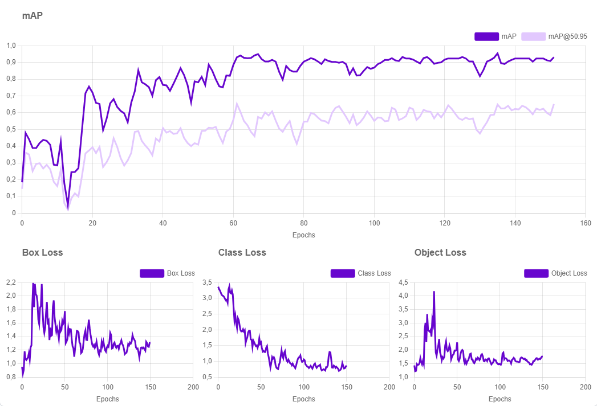 </div>
A continuación se van a explicar la diferentes gráficas de la fotografía:

- **El mAP** es una métrica utilizada en tareas de detección de objetos para evaluar la precisión del modelo en diferentes umbrales de intersección sobre la unión (IoU). En este caso, se muestran dos variantes del mAP:
  - **mAP** (línea en púrpura oscuro): mide la precisión media en varios umbrales de IoU (desde 0.5 hasta 0.95).
  - **mAP@50:95** (línea en púrpura claro): evalúa el rendimiento a un umbral específico de IoU (0.50), lo que suele ser más permisivo.

En el ámbito del mAP, se puede concluir que a lo largo de las épocas, se observa una tendencia general de mejora en ambas métricas. El mAP se estabiliza cerca de 0.9, lo que indica un buen rendimiento del modelo.
El mAP@50:95 es más bajo pero sigue una tendencia ascendente, estabilizándose en alrededor de 0.6, lo que muestra que el modelo sigue mejorando, aunque con menor precisión a mayores umbrales.

Por otro lado,  la pérdida asociada a la predicción de las cajas delimitadoras (bounding boxes), que representan los objetos en una imagen. La pérdida se refiere a la diferencia entre las predicciones del modelo y las cajas reales (ground truth).
- Inicialmente, la Box Loss es alta (alrededor de 2.2), lo que significa que el modelo cometía muchos errores en la localización de los objetos.
- A medida que las épocas avanzan, la pérdida disminuye y se estabiliza en torno a 1.0, indicando que el modelo mejora en su capacidad para predecir las posiciones de los objetos.

La pérdida de clasificación, que mide la capacidad del modelo para identificar correctamente a qué clase pertenece un objeto detectado.
- Al principio, la pérdida es alta, alrededor de 3.5, lo que indica un mal rendimiento en la clasificación de los objetos.
- A medida que el modelo entrena, la pérdida disminuye y se estabiliza entre 0.5 y 1.0, lo que significa que el modelo se vuelve mucho más preciso al identificar las clases de los objetos.

En el gráfico de la derecha, se muestra la pérdida de objetos, que está relacionada con la capacidad del modelo para detectar correctamente la presencia de objetos en una imagen.
- Inicialmente, la pérdida es alta (alrededor de 4.5), indicando que el modelo fallaba con frecuencia al detectar la presencia de objetos.
- Aunque hay algunos picos pronunciados en las primeras épocas, la pérdida disminuye y se estabiliza cerca de 1.5, lo que sugiere que el modelo mejora en su habilidad para identificar objetos con mayor precisión.

Este modelo, en cuanto a métricas se refiere, presentó un rendimiento atractivo. Existen dos problemas por parte de Roboflow por lo cual terminamos descartando dicha opción:
- La primera de ellas es que roboflow exige el usao de la API para poder usar el modelo, el modus operandi es el siguiente:
   - Primero pides a la API de roboflow mediante una API key que te dé el modelo (no lo tienes en local, lo tienes mediante una conexión a la API).
   - Para obtener la predicción de una imagen se tiene que requerir a la API para que cada frame por individual lo procese.
      - El gran problema de  esto es que un vídeo cualquiera de no mucha duración se hace eterno para que termine.
- El segundo problema es que el resultado que se obtuvo por parte de este modelo no fue bueno, de hecho, se podría decir que fue bastante malo.

Aquí se presenta un ejemplo de su comportamiento:

<div style="text-align: center;" align="center"> 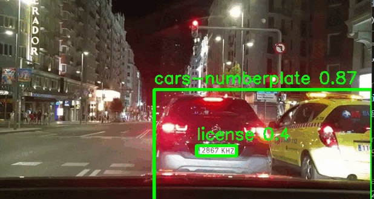 </div>

## Video de demostración


Se puede apreciar que no distingue correctamente los dos coches, los trata como una sola unidad. Además, a pesar de que se ve que detecta la matrícula en este ejemplo en otros muchos no lo hacía

En vista a lo sucedido, decidimos cambiar de estrategia y, como nos comentaron los docentes de la materia, decidimos seguir el siguiente algoritmo:
- Usar un clasificador de personas y coches. Cuando este esté clasificando algo se lo pasamos a un clasificador únicamente de matrículas que también decidimos entrenar mediante roboflow y estos fueron las métricas obtenidas

<div style="text-align: center;" align="center"> 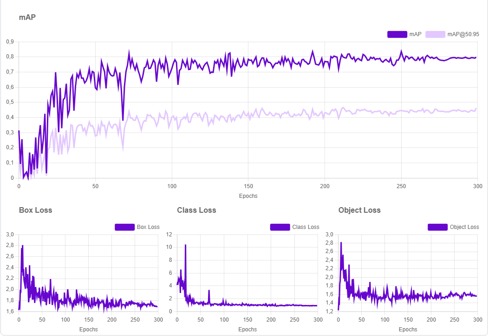 </div>

Los resultados de este segundo modelo fueron similares a los del primero, a pesar de que este se enfocaba únicamente en la clasificación de matrículas. Aunque las métricas iniciales indicaban un modelo prometedor, los resultados finales fueron decepcionantes: el modelo tuvo dificultades para manejar tanto imágenes con ruido (por ejemplo, imágenes con interferencias o baja calidad) como sin él. Consideramos que el problema no se debía al dataset, ya que contábamos con más de 290 imágenes, muchas de ellas modificadas para evitar el sobreajuste. De igual manera, al tener que llamar a la API de roboflow por cada frame el vídeo se ralentzió demasiado. 

En esta situación, se optó por entrenar un modelo con el mismo dataset que se usó con roboflow pero en local clonando el git de ultralytics para YOLO v8 y los resultados que se obtuvieron son:

<div class="image-grid">
</div>

<table>
    <td width="50%">
        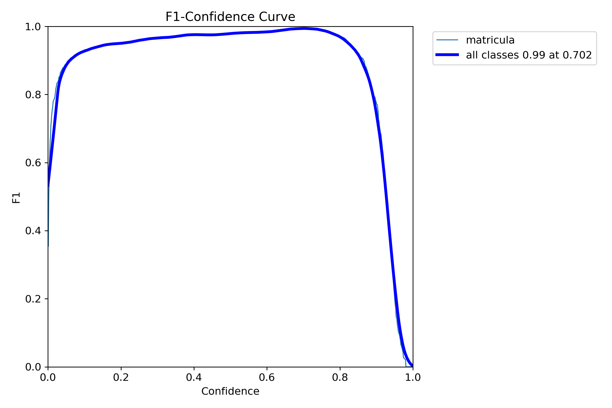
    </td>
    <td width="50%">
       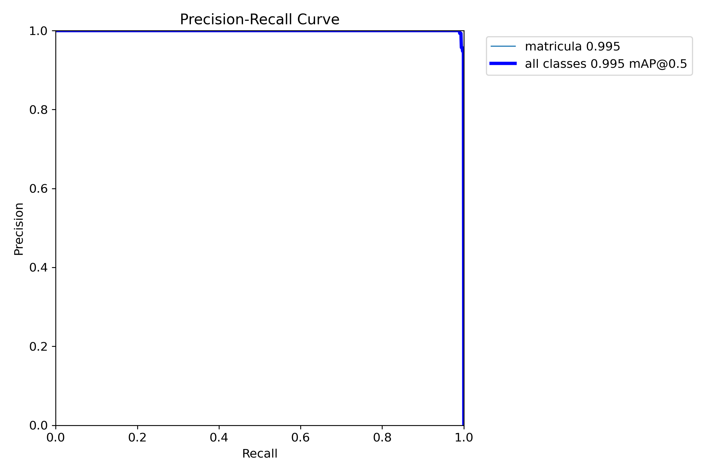
    </td>
</table>
<table>
    <td width="50%">
       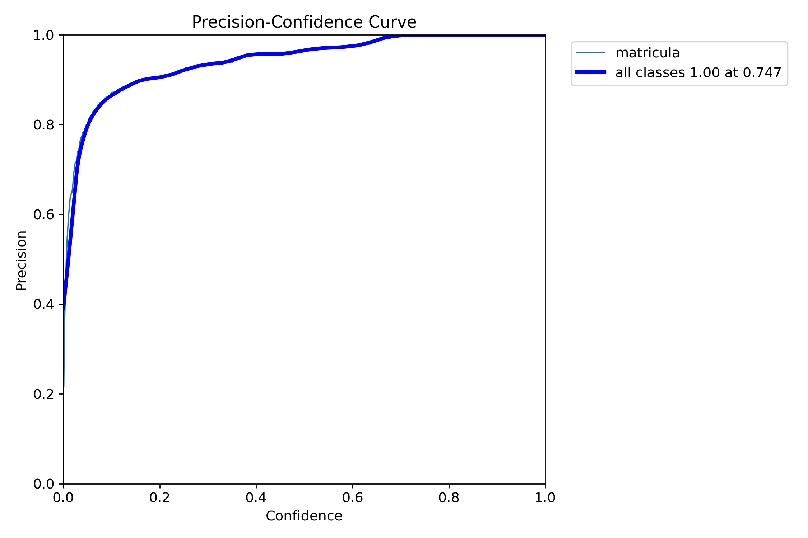 
    </td>
   <td width="50%">
       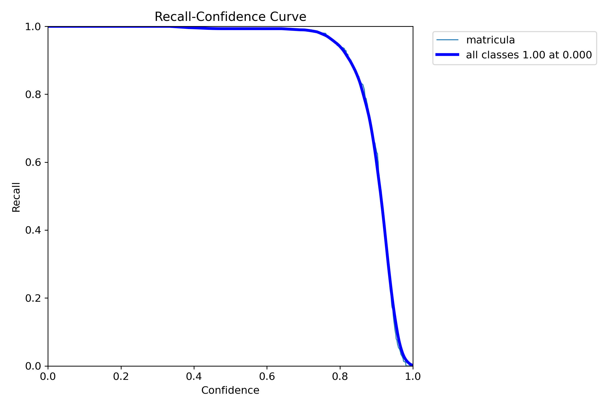
    </td>
</table>

- El recall se mantiene muy cerca de 1.0 para la mayoría de los valores de confianza (desde 0 hasta aproximadamente 0.8), lo que indica que el modelo es capaz de detectar la mayoría de los ejemplos positivos (matrículas en este caso) en una amplia gama de niveles de confianza.
- A partir de un umbral de confianza cercano a 0.8, el recall comienza a decaer rápidamente, lo que indica que el modelo se vuelve más estricto al aceptar predicciones positivas y, por lo tanto, comienza a perder algunos ejemplos positivos. Este comportamiento es esperado porque a medida que se aumenta el umbral de confianza, el modelo es más cauteloso, prefiriendo no hacer una predicción antes que cometer errores.
- La curva indica que tanto la precisión como el recall están cerca de 1.0 para la clase de "matrícula", lo cual es un excelente resultado. Esto significa que el modelo tiene una capacidad sobresaliente para identificar matrículas sin cometer muchos errores.
- El hecho de que la curva esté casi en la esquina superior derecha sugiere que el modelo mantiene altos niveles de precisión incluso cuando también tiene un alto recall, lo cual es lo ideal en cualquier modelo de detección.

Se obtuvieron buenos resultados y a la hora de probarlo no era malo, se comportó decentemente. Sin embargo, decimos quedarnos con dos modelos preentrenado que encontramos:
- Uno detecta personas y coches
- Otro detecta matrículas

A continuación, presentamos los resultados obtenidos:

<div style="text-align: center;" align="center"> 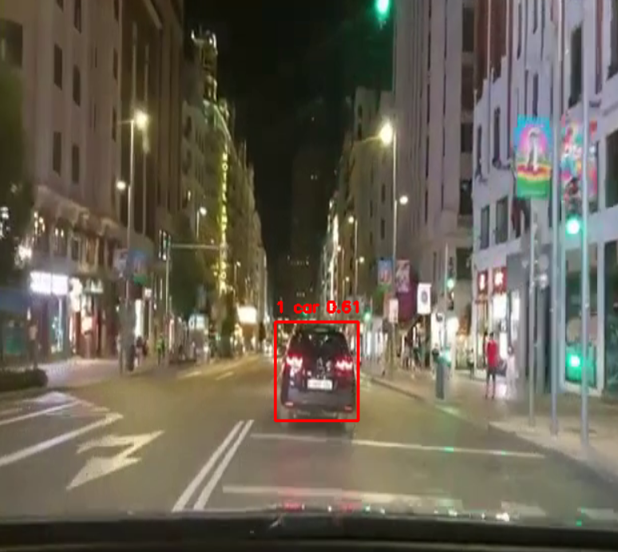 </div>

Para la anonimización de las personas se usó el siguiente código:

```python
# Anonimizamos las personas
if class_name == "person":

  # Aplicamos un desenfoque a la región de la persona
  person_roi = img[y1:y2, x1:x2]
  blurred_person = cv2.GaussianBlur(person_roi, (51, 51), 0)
  img[y1:y2, x1:x2] = blurred_person

  # Detectamos la dirección de la persona
  direction = "left" if x2 < img.shape[1] // 2 else "right"
  directions[direction] += 1
```

Primer caso: Utilizamos YOLO para detectar el vehículo, indicando el nivel de confianza con el que se ha logrado la identificación.

<div style="text-align: center;" align="center"> 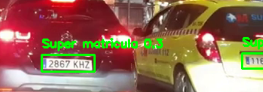 </div>

Segundo caso: El sistema detecta las matrículas de los vehículos y nos proporciona la confianza asociada a cada detección.

<div style="text-align: center;" align="center"> 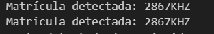 </div>

En esta imagen, correspondiente al segundo caso, se muestra en consola la matrícula detectada por el sistema.

<div style="text-align: center;" align="center"> 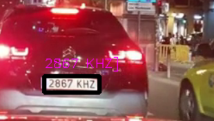 </div>

Tercer caso: Aquí se ilustra cómo el sistema ha detectado y reconocido correctamente la matrícula, mostrándola en pantalla.

<div style="text-align: center;" align="center"> 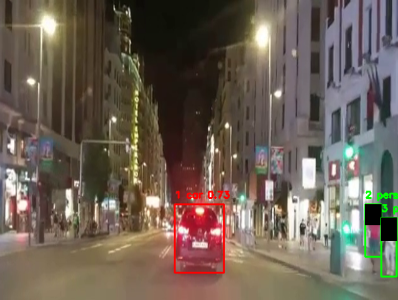 </div>

Cuarto caso: Además de detectar los vehículos, el sistema también identifica a las personas y aplica un filtro que oculta su identidad, respetando su privacidad.

Se añaden dos vídeos del funcionamiento de nuestra propuesta final con pytesseract y con easyOCR. A priori pueden parecer idénticos pero ha de fijarse en el lector de la matrícula:

<table>
   <td width="50%">
   <h3 align="center">Video Pytesseract</h3>
   <div align="center">
   
   </div>                                                                       
   </td>
   <td width="50%">
   <h3 align="center">Video EasyOCR</h3>
   <div align="center">
   
   </div>                                                                       
   </td>
</table>


Para el almacenamiento en el archivo csv se aplica las siguientes instrucciones:
```python
# Inicializamos el archivo CSV
csv_file = open("media/detected_objects_easyOCR.csv", mode='w', newline='')
csv_writer = csv.writer(csv_file)
csv_writer.writerow(['frame', 'object_type', 'confidence', 'tracking_id', 'x1', 'y1', 'x2', 'y2', 'license_plate', 'plate_confidence', 'direction'])
...More code...
# Escribimos los datos en el archivo CSV
csv_writer.writerow([frame_count, class_name, confidence, tracking_id, x1, y1, x2, y2, plate_text, confidence, direction]
```
Por último, para el almacenaje del vídeo el código implicado es:
```python
# Inicializamos el objeto para grabar el video con los resultados
fourcc = cv2.VideoWriter_fourcc(*'mp4v')
out = cv2.VideoWriter('media/output_video_easyOCR.mp4', fourcc, 20.0, (int(cap.get(3)), int(cap.get(4))))
```
En la función cv2.VideoWriter() los parámetros son:
- El nombre del archivo
- fourcc, es un código de cuatros caracteres que se usa para comprimir los frames. Por ejemplo, VideoWriter::fourcc('M','J','P','G') es un "motion-jpeg" codificador.
- FPS (fotograma por segundo)
- El tamaño de los frame del vídeo

Para obtener mejores conclusiones y analizar los resultados de forma más precisa, decidimos utilizar la biblioteca Chart.js, ampliamente popular en la creación de gráficos interactivos.

<div align="center"></div>

Como podemos observar, el modelo muestra mayor confianza en la detección de vehículos que en la de personas. Esto puede deberse a varios factores, como la iluminación, los faros de los coches o la rapidez de movimiento de las personas.

En cuanto al conteo, el sistema ha detectado más personas que coches, aunque estas cifras no necesariamente coinciden con el número real de personas o vehículos que pasan por el video. En realidad, representan la cantidad de veces que el sistema ha identificado estos objetos, lo cual indica una mayor estabilidad en la detección de los coches.

<div align="center"></div>

En este caso, podemos ver la diferencia entre EasyOCR y PyTesseract y la eficiencia de EasyOCR para el reconocimiento de matrículas.


> [!IMPORTANT]  
> Los archivos presentados aquí son una modificación de los archivos originales de [otsedom](https://github.com/otsedom/otsedom.github.io/tree/main/VC).


---

## 📚 Bibliografía

1. [Why does rotation of an image using cv2.getRotationMatrix2D and cv2.warpAffine result in clipping?](https://stackoverflow.com/questions/62370352/why-does-rotation-of-an-image-using-cv2-getrotationmatrix2d-and-cv2-warpaffine-r)
2. [OpenCV Histogram Equalization](https://docs.opencv.org/4.x/d5/daf/tutorial_py_histogram_equalization.html)
3. [Python Pytesseract image to string can't read text in image](https://stackoverflow.com/questions/59496336/python-pytesseract-image-to-string-cant-read-text-in-image)
4. [Tesseract OCR fails to correctly recognize text in vehicle license plates](https://stackoverflow.com/questions/78899657/tesseract-ocr-fails-to-correctly-recognize-text-in-vehicle-license-plates)
5. [OpenCV Thresholding](https://docs.opencv.org/3.4/d7/d4d/tutorial_py_thresholding.html)
6. [Reconocimiento de matrículas vehiculares con OpenCV y Pytesseract OCR en Python](https://omes-va.com/reconocimiento-de-matriculas-vehiculares-opencv-pytesseract-ocr-python/)
7. [Documentación ofical de OpenCV para la generación del vídeo](https://docs.opencv.org/4.x/dd/d9e/classcv_1_1VideoWriter.html#ad59c61d8881ba2b2da22cff5487465b5)
8. [Documentación oficial de python para escritura de ficheros .csv](https://docs.python.org/3/library/csv.html)

---

**Universidad de Las Palmas de Gran Canaria**  

EII - Grado de Ingeniería Informática  
Obra bajo licencia de Creative Commons Reconocimiento - No Comercial 4.0 Internacional

---
